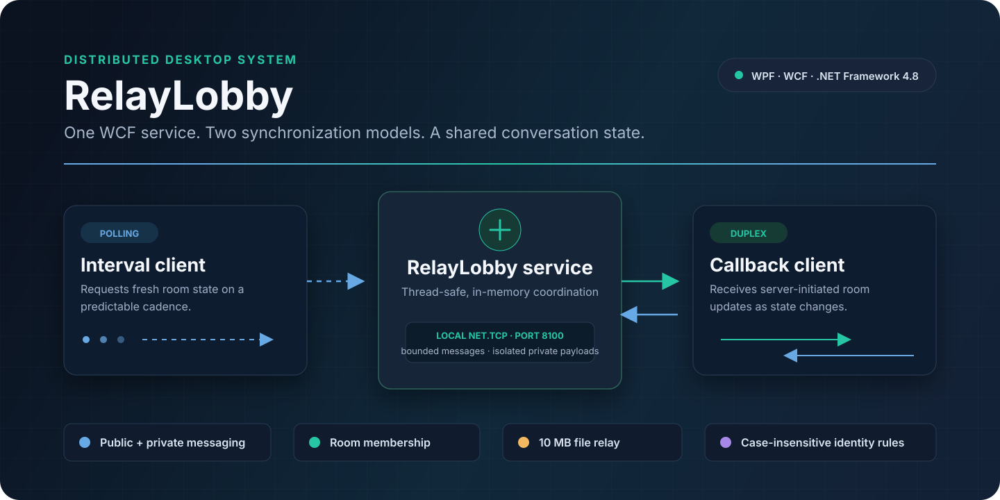
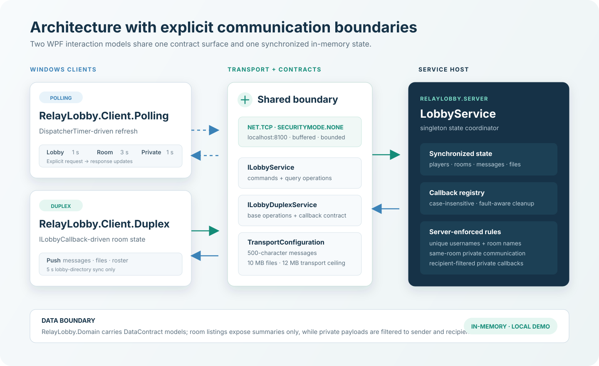

<p align="center">
  
</p>

<p align="center">
  <a href="https://github.com/Himath2002/relay-lobby-wcf/actions/workflows/windows-build.yml"></a>
  <a href="https://github.com/Himath2002/relay-lobby-wcf/releases"></a>
  
  
</p>

# RelayLobby

RelayLobby is a Windows desktop conversation system that implements the same lobby experience through two deliberately different distributed-communication models:

- a **polling client** that requests fresh state on predictable intervals;
- a **duplex client** that receives room-state updates through WCF callbacks.

Both WPF clients use the same typed contracts, local Net.TCP transport, validation rules, and thread-safe in-memory service. That side-by-side design makes the repository a practical comparison of client pull and server push—not two unrelated demos.

## At a glance

| Area | What RelayLobby demonstrates |
|---|---|
| Distributed communication | WCF service contracts over `NetTcpBinding` |
| Client strategies | interval polling and duplex callbacks |
| Concurrency | a singleton service with synchronized shared state |
| Collaboration | rooms, participant rosters, public and private messages |
| File transfer | public and private in-memory relay, capped at 10 MB |
| Boundary design | summary-only room listings and recipient-filtered private callbacks |
| Desktop UI | two WPF clients using one restrained, code-native visual system |

## Communication models

### Polling

The polling client owns the refresh cadence:

1. a WPF `DispatcherTimer` requests state;
2. the server returns a snapshot for the authenticated user;
3. the client replaces the corresponding UI collection.

The lobby refreshes every second, room state every three seconds, and an open private conversation every second. The model is straightforward and resilient, but it performs work even when nothing changes.

### Duplex callbacks

The duplex client registers an `ILobbyCallback` channel during login:

1. the client sends a command such as joining a room or posting a message;
2. the service updates synchronized state;
3. the service pushes a filtered room snapshot to connected duplex participants.

The room and private-chat views therefore update from server callbacks. A five-second lobby-directory sync remains intentional because room creation is not part of the room-state callback contract.

<p align="center">
  
</p>

## Architecture

```text
RelayLobby.sln
│
├── RelayLobby.Client.Polling ──┐
├── RelayLobby.Client.Duplex  ──┼── Net.TCP / localhost:8100
│                               │
├── RelayLobby.Contracts      ◄─┘
│   ├── ILobbyService
│   ├── ILobbyDuplexService
│   ├── ILobbyCallback
│   └── TransportConfiguration
│
├── RelayLobby.Server
│   ├── Program
│   └── LobbyService
│
└── RelayLobby.Domain
    ├── Player
    ├── LobbyRoom
    ├── LobbyRoomSummary
    ├── Message
    └── SharedFile
```

The server is the single source of truth. Clients never mutate shared models directly; every state transition goes through a service operation.

### Endpoint map

| Client | Contract | Address | Update direction |
|---|---|---|---|
| Polling | `ILobbyService` | `net.tcp://localhost:8100/RelayLobby/Polling` | request → response |
| Duplex | `ILobbyDuplexService` | `net.tcp://localhost:8100/RelayLobby/Duplex` | request → response + server callback |

## Capabilities

- Case-insensitive login uniqueness
- Case-insensitive room-name uniqueness
- Default `General` room plus runtime room creation
- Join, leave, and participant-presence flows
- Public messages scoped to the current room
- Private messages restricted to two users in the same room
- Public and private file sharing
- Safe file-name normalization before relay
- Polling-client reconnection after a faulted WCF channel
- Duplex callback cleanup for faulted, timed-out, or disposed clients
- Graceful host close with abort fallback

## Quick start

### Prerequisites

- Windows 10 or Windows 11
- Visual Studio 2022 or Build Tools for Visual Studio 2022
- **.NET desktop development** workload
- .NET Framework 4.8 Developer Pack

WPF is Windows-specific. The domain, contracts, and service can compile on Mono, but the complete solution and both clients require the Windows desktop toolchain.

### 1. Clone and build

Open **Developer PowerShell for VS 2022**:

```powershell
git clone https://github.com/Himath2002/relay-lobby-wcf.git
cd relay-lobby-wcf
msbuild RelayLobby.sln /restore /t:Rebuild /p:Configuration=Release /m
```

### 2. Start the service

```powershell
.\src\RelayLobby.Server\bin\Release\net48\RelayLobby.Server.exe
```

A successful start prints:

```text
RelayLobby server is online.
  Polling endpoint: net.tcp://localhost:8100/RelayLobby/Polling
  Duplex endpoint : net.tcp://localhost:8100/RelayLobby/Duplex
Press ENTER to stop.
```

Keep this terminal open.

### 3. Start one or both clients

Polling:

```powershell
.\src\RelayLobby.Client.Polling\bin\Release\net48\RelayLobby.Client.Polling.exe
```

Duplex:

```powershell
.\src\RelayLobby.Client.Duplex\bin\Release\net48\RelayLobby.Client.Duplex.exe
```

Open multiple client processes with different names to exercise shared-room and private-communication flows.

### 4. Try the complete flow

1. Sign in as two different users.
2. Create or select a room.
3. Join the same room from both clients.
4. Send a public message and observe the different refresh behavior.
5. Select the other participant and open a private conversation.
6. Share a small file publicly or privately.
7. Leave the room, sign out, then press <kbd>Enter</kbd> in the server terminal.

## Inputs and outputs

| Input | Server rule | Visible result |
|---|---|---|
| Display name | 1–40 characters; unique ignoring case | participant identity |
| Room name | 1–60 characters; unique ignoring case | room-directory entry |
| Message | 1–500 characters | public room log or two-user private log |
| File | maximum 10 MB | downloadable public or private file entry |
| Room membership | authenticated user + existing room | roster and room-state update |

The transport ceiling is 12 MB, leaving protocol overhead above the 10 MB application file limit. Reader quotas are bounded rather than set to unlimited values.

## Project structure

```text
.
├── .github/
│   ├── dependabot.yml
│   └── workflows/
│       └── windows-build.yml
├── docs/
│   ├── architecture.svg
│   ├── hero.svg
│   ├── social-preview.png
│   └── social-preview.svg
├── src/
│   ├── RelayLobby.Client.Duplex/
│   ├── RelayLobby.Client.Polling/
│   ├── RelayLobby.Contracts/
│   ├── RelayLobby.Domain/
│   └── RelayLobby.Server/
├── .editorconfig
├── Directory.Build.props
├── RelayLobby.sln
├── CHANGELOG.md
├── README.md
└── SECURITY.md
```

## Engineering decisions

### One service, two endpoints

The server exposes separate polling and duplex endpoints because the callback contract changes the WCF channel shape. Both endpoints are backed by the same `LobbyService` instance, so behavior and state rules stay consistent.

### Summary objects at the directory boundary

`GetLobbyRooms()` returns `LobbyRoomSummary`, not full `LobbyRoom` objects. Room discovery therefore exposes only a name and participant count—never message or file collections.

### Recipient-filtered callback payloads

Before a duplex broadcast, the service filters private messages and files for each participant. A callback receives only private items where that participant is sender or recipient.

### Explicit limits

Message, username, room-name, file, buffer, and XML-reader limits live in `TransportConfiguration`. Clients provide early feedback, while the server remains the authoritative validator.

### Code-native visual system

Both WPF clients use a shared palette and control language implemented entirely in XAML. The repository does not depend on third-party game artwork, binary theme packs, or remote UI assets.

## Security boundary

RelayLobby is a **localhost engineering demonstration**, not an internet-facing chat product.

- `SecurityMode.None` is explicit and appropriate only for the documented local-machine scenario.
- State is held in memory and disappears when the server stops.
- Usernames identify sessions; there is no credential authentication or authorization.
- Files are relayed in memory and are not malware-scanned.
- The service is bound to `localhost`, not a LAN or public interface.

Do not expose port `8100` outside the local machine without adding transport security, authenticated identities, authorization, durable storage controls, and content scanning.

For vulnerability reporting, see [SECURITY.md](SECURITY.md).

## Verification

The repository uses three complementary gates:

| Gate | Coverage |
|---|---|
| Windows CI | restores and rebuilds the complete WPF/WCF solution in Release mode |
| Core build | compiles domain, contracts, and server with warnings treated as errors |
| Contract smoke flow | exercises login, duplicate rejection, room creation, two-user membership, public/private messaging, roster summaries, leave, and logout against a live host |

The WPF clients must be runtime-checked on Windows because macOS does not provide `PresentationCore` or `PresentationFramework`.

## Troubleshooting

### The client cannot connect

Start `RelayLobby.Server.exe` first and confirm both endpoint lines appear. All components must use port `8100`.

### Port 8100 is already in use

Stop the other process using the port, or change all four addresses and `Port` together in `TransportConfiguration.cs`.

### A username is rejected

Names are unique without regard to case. `Alex` and `alex` represent the same active identity.

### Private communication fails

Both users must be logged in and joined to the same room.

### The solution does not build

Use Visual Studio 2022 with the .NET desktop development workload and the .NET Framework 4.8 Developer Pack. A modern .NET SDK alone does not provide the Windows WPF toolchain on macOS or Linux.

## Ownership and reuse

RelayLobby is an original portfolio project by **Himath Ahangama**. The source is public for review and evaluation. No open-source license is granted; obtain permission before copying, modifying, or redistributing the project.
